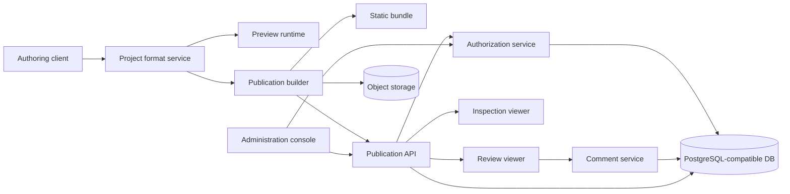

# MockupFX Target Architecture

## 1. Architectural intent

MockupFX is designed as an **open project format plus interoperable services**. The editor, preview runtime, static exporter, hosted viewer, inspection surface, and self-hosted control plane must share one canonical project model. A user must be able to retain a project and its exported prototype even if a particular hosting provider or editor implementation disappears.

The architecture separates creation from publication. The authoring model holds editable intent; the publication model holds immutable, reviewable output. This separation mirrors the practical distinction between browser preview, generated web output, and hosted review described in the reference documentation.[1]

## 2. Logical components



| Component | Responsibility | Must not own |
|---|---|---|
| **Authoring client** | Edit pages, components, responsive overrides, variables, and interactions | Authorization decisions or publication immutability |
| **Project format service** | Validate and migrate the canonical project document | Browser-specific rendering behavior |
| **Preview runtime** | Execute the project interaction model deterministically in a local/browser context | Persisted production comments or workspace membership |
| **Publication builder** | Compile a validated revision into a versioned static bundle and manifest | Editing mutable projects after publication |
| **Viewer** | Render a selected immutable publication and enforce access policy | Authoring or unpublished draft data |
| **Comment service** | Store threaded review feedback against publication/page/coordinate | Arbitrary execution inside the viewer |
| **Inspection viewer** | Expose selection metadata, measurements, styles, and permitted assets | Claiming production code generation |
| **Authorization service** | Resolve tenant, organization role, workspace grant, share policy, and audit events | Client-side-only enforcement |
| **Administration console** | Manage organization lifecycle, members, configuration, and operational status | Bypassing auditable authorization pathways |

## 3. Canonical project format

The initial format is an UTF-8 JSON document named `mockupfx.project.json`, accompanied by an `assets/` directory. It uses semantic versioning in the top-level `formatVersion` field. Project IDs, page IDs, component IDs, interaction IDs, branch IDs, and action IDs are opaque stable identifiers, not array positions.

```json
{
  "formatVersion": "1.0.0",
  "project": {
    "id": "prj_01H...",
    "name": "Sample checkout",
    "startPageId": "page_cart"
  },
  "pages": [{ "id": "page_cart", "name": "Cart", "rootComponentId": "cmp_root" }],
  "components": [{
    "id": "cmp_checkout",
    "type": "button",
    "parentId": "cmp_root",
    "properties": { "text": "Checkout", "role": "button" },
    "layout": { "x": 24, "y": 440, "width": 168, "height": 44 },
    "responsiveOverrides": { "mobile": { "layout": { "width": 312 } } }
  }],
  "variables": [{ "id": "var_cartCount", "type": "number", "scope": "project", "initialValue": 2 }],
  "interactions": [{
    "id": "int_checkout_click",
    "ownerId": "cmp_checkout",
    "event": "click",
    "branches": [{
      "id": "branch_default",
      "enabled": true,
      "condition": { "type": "literal", "value": true },
      "actions": [{ "id": "act_go_confirm", "type": "navigate", "pageId": "page_confirmation" }]
    }]
  }]
}
```

The published bundle must include `mockupfx.manifest.json` with `projectId`, `publicationId`, `formatVersion`, source revision, generated timestamp, content hashes, asset inventory, entry page, and renderer compatibility. A builder must reject a project with dangling IDs, invalid variable values, unknown action types, cycles that the runtime cannot support, or an incompatible format version.

## 4. Interaction execution contract

The preview and static viewer share one runtime package. When an event occurs, the runtime resolves the source component, collects the event's enabled branches in stored order, evaluates each condition, executes the first matching branch, and records every evaluated branch and action in a trace. This first-match policy is intentionally explicit because ordered conditional cases and ordered actions can otherwise become ambiguous.[2]

Actions may modify project/page/component state, alter visual properties, navigate, open overlays, focus a component, scroll, or emit a named event. An action must either complete, fail with a typed error, or be skipped because a precondition is false. The trace records the outcome without exposing secrets or protected variable values.

## 5. Publication and static export

A publication request operates on a validated project revision. The builder produces content-addressed assets and a deterministic bundle when inputs and generator versions are unchanged. The initial static output is intentionally plain: HTML, CSS, JavaScript, assets, and a manifest. It can be zipped, served from a local directory, or hosted by any static web server.

A hosted deployment stores a publication record, an immutable object prefix, access policy, and previous-publication linkage. A share link resolves to a publication, never to a mutable working copy. Access code values are processed by a verifier rather than embedded in the link. The viewer obtains only the assets and configuration allowed by the resolved policy.

## 6. Data ownership and security boundaries

| Data class | System of record | Access rule |
|---|---|---|
| Editable project metadata | PostgreSQL-compatible database plus versioned project document | Editor or higher grant in the owning workspace |
| Publication manifest and static assets | Object storage | Only through policy-scoped viewer/export paths |
| Comments and audit events | PostgreSQL-compatible database | Workspace/publication policy; audit logs limited to administrators |
| Password verifiers and external credentials | Secrets store or encrypted database fields | Never returned to client or included in a static bundle |
| Share access-code verifier | Database | Read only during share-link validation; raw value not persisted |

Every request carries a tenant and authenticated or share-link principal. The server resolves the tenant before project lookup and checks both organization role and workspace grant. The client may hide unavailable controls but must never be relied on as the authorization boundary.

## 7. Public interfaces

The initial API will be specified in OpenAPI and include versioned endpoints for project validation, publication creation/listing, viewer bootstrap, comments, inspection metadata, workspace membership, and audit-log export. Client code should use generated types or a documented SDK; direct database access is not a supported integration contract.

Plugins must not run inside exported bundles in the MVP. A later plugin API may contribute component types, validators, build transforms, or inspection adapters through an isolated process boundary and a documented capability manifest.

## 8. Compatibility and migrations

The format version follows semantic versioning. A reader must reject a higher incompatible major version with a clear error. Minor versions may add optional fields. Migration tools must create a new revision rather than overwrite an existing one, report every transformation, and keep a backup of the original document. Published artifacts are never mutated in place.

## 9. Architecture decisions requiring maintainer review

A proposal requires architecture review before merge if it changes the public project schema, action execution semantics, static bundle layout, tenant isolation, authorization policy, object-storage boundary, encryption/key handling, or external plugin protocol. See [Governance](../../GOVERNANCE.md) for the decision process.

## References

[1]: https://docs.axure.com/axure-rp/reference/viewing-sharing-prototypes/ "Axure Docs: Viewing and sharing prototypes"
[2]: https://docs.axure.com/axure-rp/reference/events-cases-actions/ "Axure Docs: Events, cases, and actions"
