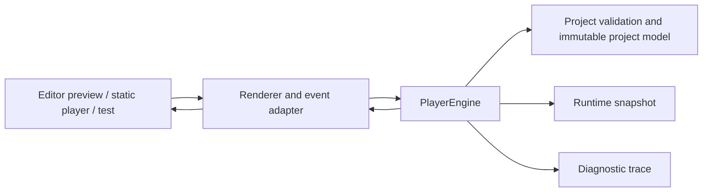

# MockupFX Interactive Preview Player Engine Specification

> **Status:** Approved initial implementation scope. This document defines the `runtime-core` module and its first executable slice. It is normative for the initial source scaffold unless a later architecture decision record supersedes a section.

## 1. Objective

The **interactive preview player engine** executes a validated MockupFX project without an authoring editor or hosted service. It converts an incoming event into a deterministic state transition, navigation change, and trace. The same engine must be usable by local preview, a static exported bundle, automated conformance tests, and future hosted viewers.

The engine is deliberately browser-neutral. It does not directly manipulate the DOM, run arbitrary JavaScript, access the network, or persist data. A renderer or host adapts DOM events to the engine and applies the resulting immutable snapshot to a visual surface. This boundary keeps prototype behavior portable and testable.

The first slice establishes the public runtime contract. It supports page navigation, typed project variables, mutable component text and visibility, ordered conditional interactions, named event emission, history, reset, and a privacy-safe diagnostic trace. It is not a complete visual renderer or a general-purpose programming environment.

## 2. Scope and constraints

### 2.1 Initial implementation scope

The initial engine supports a project with stable page and component identifiers. An interaction belongs to a component or page owner, listens for a named event, contains ordered branches, and contains ordered actions. The engine supports literal and variable conditions. It supports the following effects:

| Effect | Required behavior |
|---|---|
| `navigate` | Change the active page after validating that the page exists; append the prior page to history unless the mode is `replace` |
| `setVariable` | Update one declared variable with a value compatible with its declared type |
| `setText` | Set the text override of one target component |
| `setVisibility` | Set the visibility override of one target component |
| `emit` | Add a named event to the bounded FIFO dispatch queue after the enclosing event commits |

The engine also supports initial state creation, snapshot reading, reset to declared initial values, safe URL-state encoding/decoding for page selection, and trace capture.

### 2.2 Explicitly deferred work

The first slice does not provide a visual component renderer, expression language, timers, animations, drag/swipe recognition, data repeaters, responsive inheritance resolution, browser history synchronization, comments, permissions, network mocks, plugins, or persistence. Those features must reuse this module's event, trace, error, snapshot, and validation contracts rather than create a second runtime.

### 2.3 Non-negotiable constraints

The core is pure TypeScript and runs in Node.js 22 and current evergreen browsers. It accepts plain project data and returns plain data. It has no direct dependency on React, a canvas library, browser globals, network APIs, local storage, or a hosted MockupFX service. It never evaluates source-provided JavaScript or an unbounded expression string.

## 3. Architecture and ownership



| Layer | Owns | Must not own |
|---|---|---|
| `@mockupfx/format` | Project types, structural validation, stable ID and reference rules | Mutable runtime state, browser events, rendering |
| `@mockupfx/runtime` | Event queue, conditions, effect transactions, navigation, snapshots, trace, typed runtime errors | DOM mutations, network calls, persistence, authorization |
| Future viewer/preview host | DOM accessibility, layout/rendering, browser URL synchronization, focus application, user input adaptation | Interaction ordering, branch selection, project mutation semantics |
| Future exporter | Bundle construction and asset layout | A separate runtime behavior implementation |

The host dispatches a normalized event to the engine and then renders the returned snapshot. A host may call `dispatch` serially only. It must not mutate a supplied snapshot or project object.

## 4. Canonical runtime data contract

### 4.1 Project subset

The runtime accepts a `ProjectDocument` supplied by `@mockupfx/format`. The initial document subset is shown below. Identifiers are opaque strings. They are never inferred from array position.

```ts
interface ProjectDocument {
  formatVersion: '0.1.0';
  project: { id: string; name: string; startPageId: string };
  pages: Array<{ id: string; name: string; rootComponentId: string }>;
  components: Array<{
    id: string;
    pageId: string;
    type: 'text' | 'button' | 'container' | 'image';
    text?: string;
    visible?: boolean;
  }>;
  variables: Array<{
    id: string;
    type: 'string' | 'number' | 'boolean';
    initialValue: string | number | boolean;
  }>;
  interactions: Interaction[];
}
```

An interaction contains `id`, `ownerId`, `event`, and ordered `branches`. A branch contains `id`, `enabled`, a `condition`, and ordered `actions`. Valid action types are the five entries in Section 2.1.

### 4.2 Immutable project versus mutable snapshot

The parsed project document is immutable runtime input. The engine creates a separate `RuntimeSnapshot`:

```ts
interface RuntimeSnapshot {
  currentPageId: string;
  history: string[];
  variables: Record<string, string | number | boolean>;
  components: Record<string, { text?: string; visible?: boolean }>;
}
```

The snapshot records only runtime overrides. If a component has no override entry, the renderer uses the authored document value. `getSnapshot()` returns a deep copy. The engine never expose its internal mutable object.

### 4.3 Validation rules

The format validator must reject a document before the runtime is constructed when it has an unsupported format version, duplicate ID, missing start page, component with an unknown page, interaction with an unknown owner, action target that does not exist, action variable that does not exist, navigation page that does not exist, duplicate variable ID, or an `initialValue` incompatible with the declared variable type.

The runtime validates action values at execution time as well. This protects a host that constructs an action payload dynamically and provides explicit failure evidence.

## 5. Deterministic event execution

### 5.1 Dispatch contract

`dispatch(event)` accepts `{ ownerId, name, payload? }` and returns a `DispatchResult`. One public dispatch serially drains a bounded FIFO queue. The initial event is the first queue entry. `emit` actions append a new event only after their parent event commits successfully.

The engine finds interactions whose `ownerId` and `event` match the queued event in document order. For each interaction, it evaluates enabled branches in stored order. It selects the **first** branch whose condition is true. It records disabled branches, false conditions, the selected branch, and branches skipped after a selection. An interaction with no matching branch completes with no state change.

The selected branch's actions execute in stored order against a draft snapshot. If an action fails, the current event fails and its entire draft is discarded. The next queued event is not processed. State committed by earlier queued events remains committed. This gives each event an atomic state transition while allowing an intentional chain of named events.

### 5.2 Queue safety

The default `maxEventsPerDispatch` is 100. The runtime fails with `RUNTIME_EVENT_LIMIT` before processing another queued event after the limit is reached. This prevents unbounded self-emission and mutual-emission loops. A host may lower the limit but may not set it to less than one.

The core is synchronous. A future timer/effect module must enqueue new events through this same scheduler, preserve sequence order, and state its cancellation semantics in an additive specification.

### 5.3 Conditions

The initial condition algebra is deliberately small:

| Condition type | Meaning |
|---|---|
| `literal` | The provided Boolean determines the result |
| `variableEquals` | A named variable is strictly equal to an expected typed value |
| `variableIsTruthy` | A named variable has a truthy value |

Conditions are data, not source code. An unknown variable, malformed condition, or incompatible expected value produces a typed runtime error. The condition evaluator has no access to global functions, the network, the clock, browser state, or host objects.

### 5.4 Effects

`navigate` validates the page, changes `currentPageId`, and either pushes the prior page to `history` or replaces the current route. `setVariable` verifies the declared type. `setText` and `setVisibility` require a known component. `emit` requires nonempty owner and event names. The initial implementation does not infer event targets from DOM structure.

All actions emit a trace action entry with a success, skipped, or failed status. Action values that could be sensitive in a future project type must be redacted by the trace serializer. The initial format intentionally declares no secret variable type.

## 6. Navigation and safe URL state

The snapshot's `currentPageId` is the canonical runtime route. The engine's `toUrlState()` returns `?page=<encoded-page-id>` only. It never serializes variable values, access codes, user identity, comments, arbitrary payloads, or debug traces.

`parseUrlState(input, document)` accepts either a query string or URLSearchParams, ignores unknown parameters, rejects an unknown `page` through a typed result, and otherwise returns the document start page. A browser adapter is responsible for `history.pushState`, `popstate`, and focus restoration. It must dispatch navigation through the engine rather than mutate `currentPageId` directly.

## 7. Trace, diagnostics, and errors

The engine emits an in-memory `RuntimeTrace`. It has a monotonically increasing `sequence` and entries for `event-started`, `branch-evaluated`, `branch-selected`, `action-completed`, `action-failed`, `event-committed`, and `event-failed`. Every entry carries a dispatch ID and interaction/branch/action IDs when relevant.

A `RuntimeError` has a stable `code`, human-readable `message`, and a public context object containing only IDs and types. Initial codes are:

| Code | Meaning |
|---|---|
| `RUNTIME_EVENT_LIMIT` | The dispatch queue exceeded its configured bound |
| `RUNTIME_UNKNOWN_OWNER` | An event names an owner not present in the document |
| `RUNTIME_UNKNOWN_PAGE` | Navigation names a missing page |
| `RUNTIME_UNKNOWN_COMPONENT` | A component action names a missing component |
| `RUNTIME_UNKNOWN_VARIABLE` | A condition or action names a missing variable |
| `RUNTIME_TYPE_MISMATCH` | A runtime value conflicts with declared variable type |
| `RUNTIME_INVALID_EVENT` | Event owner/name is empty or structurally invalid |
| `RUNTIME_INVALID_ACTION` | An action is structurally unsupported or malformed |

A trace is an engineering aid. It is not a persistence format, an authorization log, or an analytics channel. Hosts must expose it only through an explicit debug policy.

## 8. Public TypeScript interfaces

```ts
interface PlayerEngineOptions {
  maxEventsPerDispatch?: number;
  trace?: boolean;
  initialPageId?: string;
}

interface DispatchEvent {
  ownerId: string;
  name: string;
  payload?: Record<string, unknown>;
}

interface DispatchResult {
  snapshot: RuntimeSnapshot;
  trace: RuntimeTraceEntry[];
  processedEvents: number;
  error?: RuntimeError;
}

class PlayerEngine {
  constructor(project: ProjectDocument, options?: PlayerEngineOptions);
  dispatch(event: DispatchEvent): DispatchResult;
  getSnapshot(): RuntimeSnapshot;
  reset(): RuntimeSnapshot;
  toUrlState(): string;
}
```

The constructor validates the project and options. `dispatch` does not throw expected runtime failures; it returns an error result with the last committed snapshot and trace. Invalid construction input may throw a format validation error because no usable engine exists.

## 9. Accessibility and host adapter requirements

The engine itself has no DOM. The browser host must apply snapshot changes using native semantic elements where possible. A button component maps to a `<button>` or an equivalent accessible control. The host must expose keyboard activation that results in the same normalized `click` event as pointer activation. It must preserve visible focus, avoid focus traps, respect reduced-motion settings in future animation adapters, and move focus to an appropriate landmark or declared focus target after navigation.

The initial engine's determinism enables accessible parity: the exact same event type must produce the same snapshot regardless of whether it came from keyboard, pointer, touch adaptation, or a conformance test. Drag-only behavior cannot be introduced without a keyboard or single-pointer alternative.[1]

## 10. Security and privacy requirements

The runtime performs no source-code evaluation. It does not accept function objects in project data, construct dynamic `Function` instances, execute HTML, or read browser storage. It validates owner, page, component, and variable references before mutation. URL state is allowlisted and contains no sensitive runtime state. Trace serialization must omit unrecognized payload keys by default.

A future renderer must escape text by default and treat authored HTML as untrusted. A future plugin, network, expression, or external-font feature requires a separate security design review before it is connected to this engine.[2]

## 11. Performance and compatibility requirements

The initial target is a modern evergreen browser and Node.js 22. The engine must complete a simple interaction fixture containing fewer than 100 components, 20 interactions, and fewer than 10 queued events within **8 ms** on the CI baseline, excluding DOM rendering. Test fixtures use a fake clock; the initial runtime does not read the real clock.

The engine should avoid cloning the complete project on every action. It may clone the small mutable snapshot once per queued event. Public snapshots must be copied before return. A future large-project benchmark must establish a separate budget before the engine adds collections, expressions, or animation.

## 12. Four-level acceptance criteria

### Function criteria

- **AC-PE-F-001:** `variableEquals` returns true only for strict equality against the declared runtime value.
- **AC-PE-F-002:** `setVariable` rejects a value whose runtime type does not equal the variable declaration type.
- **AC-PE-F-003:** `navigate` updates the route and records history according to `push` or `replace` mode.
- **AC-PE-F-004:** `parseUrlState` accepts a known page and rejects an unknown one without exposing any other URL value.
- **AC-PE-F-005:** A failed effect does not mutate the current event's snapshot draft.

### Component criteria

- **AC-PE-C-001:** `PlayerEngine` returns a deep-copy snapshot that cannot mutate its internal state.
- **AC-PE-C-002:** `PlayerEngine` evaluates branches in stored order and executes exactly one matching branch per interaction.
- **AC-PE-C-003:** `PlayerEngine` processes emitted events in FIFO order and stops at the configured bound.
- **AC-PE-C-004:** `RuntimeTrace` sequences entries monotonically within a dispatch.

### Module criteria

- **AC-PE-M-001:** `@mockupfx/runtime` depends only on `@mockupfx/format` and TypeScript standard APIs.
- **AC-PE-M-002:** The runtime runs unchanged in Node.js 22 tests and the browser-targeted build.
- **AC-PE-M-003:** Invalid project references are rejected before dispatch by `@mockupfx/format`.
- **AC-PE-M-004:** Trace output contains no arbitrary event payload values by default.
- **AC-PE-M-005:** The reference fixture completes within the 8 ms engine budget in the benchmark test environment.

### System criteria

- **AC-PE-S-001:** A fixture can accept a component click, evaluate a true condition, update a variable, navigate to a second page, and provide a deterministic trace.
- **AC-PE-S-002:** A fixture can emit a named event after a commit, update a visible component through that event, and show FIFO trace ordering.
- **AC-PE-S-003:** A failed action leaves the previous committed state unchanged and produces an actionable trace/error result.
- **AC-PE-S-004:** The same fixture state and trace are produced by the local Node test host and future static viewer adapter tests.

## 13. Implementation sequence

The source scaffold begins with workspace configuration and test infrastructure. The team writes and runs format and runtime tests before source implementation. It then implements types/validation, condition evaluation, action application, engine queue/transaction behavior, URL state, trace, fixture, and a command-line self-test. No DOM renderer is included in this first code change.

Detailed file-level sequencing, commands, risk controls, and task checklists are in [Player Engine Implementation Plan](../developer/PLAYER-ENGINE-IMPLEMENTATION-PLAN.md).

## References

[1]: https://www.w3.org/WAI/WCAG22/Understanding/dragging-movements.html "Understanding Success Criterion 2.5.7: Dragging Movements"
[2]: https://owasp.org/www-community/attacks/xss/ "OWASP Cross Site Scripting Prevention"
[3]: ../developer/CONFORMANCE-AND-SELF-TESTING.md "MockupFX Conformance and Self-Testing"
[4]: ../architecture/ARCHITECTURE.md "MockupFX Target Architecture"
