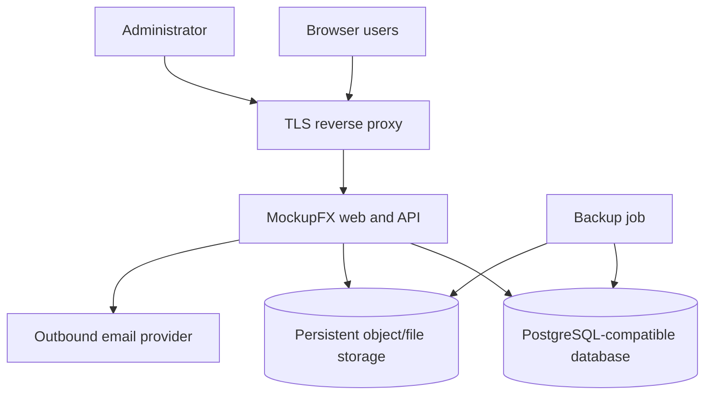

# MockupFX Self-Hosting Guide

> **Implementation status:** This is the target operational contract for the first self-hosted release. It is not yet a tested installation manual. Commands, image names, environment variables, and resource values will be added only after the reference deployment exists and the procedures are rehearsed.

## 1. Deployment objective

A self-hosted MockupFX installation must allow an organization to retain control of its users, editable projects, immutable publications, assets, comments, audit events, and backups. The deployment must work as a small evaluation installation on one host and scale by separating web/API, database, and object/file storage responsibilities.

Public reference documentation treats organization administration, private deployment, upgrades, storage, database selection, and authentication configuration as first-class operational concerns. The same breadth is required for MockupFX's open-source offering.[1]

## 2. Target topology

| Component | Minimum responsibility | Production recommendation |
|---|---|---|
| TLS reverse proxy | Terminate HTTPS and forward to the web/API service | Enforce modern TLS, request-size limits, security headers, and access logs |
| Web and API | Serve editor/viewer/admin UI and enforce authorization | Run stateless replicas only after session, upload, and job behavior supports it |
| Database | Store tenants, projects metadata, publications, comments, roles, and audit events | Use managed or well-operated PostgreSQL-compatible service with encrypted backups |
| Object/file storage | Store original assets and immutable publication bundles | Use versioned durable object storage or a monitored persistent volume with backup |
| Email provider | Deliver invitations, password reset, and notifications | Use a dedicated authenticated provider and monitor bounces/failures |

## 3. Required deployment properties

The reference distribution must provide a containerized or scripted installation; database migrations; persistent-volume or object-storage configuration; a first-run bootstrap administrator; health and readiness endpoints; configuration validation; and a test-email operation. It must not ship with default credentials, permissive cross-origin configuration, or an insecure development secret.

The initial supported database contract is PostgreSQL-compatible. File storage must be abstracted so an evaluation deployment can use a local persistent volume while production deployments may use an S3-compatible service. Object storage must use tenant-scoped keys and must not be directly public by default.

## 4. Configuration model

Configuration is supplied through environment variables or an external secret manager. A planned release will publish a complete `.env.example` with safe, non-functional placeholders. The following categories are required.

| Category | Required settings | Operational rule |
|---|---|---|
| Application | Public base URL, environment, log level, trusted proxy | Reject startup if public URL or proxy mode would produce insecure cookies |
| Database | Connection URL, SSL mode, migration policy | Use least-privilege credentials; do not run normal API traffic as the migration owner |
| Storage | Backend type, bucket/path, endpoint, credentials, encryption policy | Validate write/read/delete only within a generated test prefix |
| Authentication | Session signing key, password policy, reset-token lifetime, allowed origins | Keys come from a secret store or protected environment; rotate with a documented procedure |
| Email | SMTP/API endpoint, sender identity, credentials | Test send before invitations or password resets are enabled |
| Security | CSRF mode, rate-limit thresholds, access-code verifier parameters, audit retention | Defaults favor deny-by-default and structured audit events |
| Observability | Metrics endpoint policy, tracing endpoint, error-reporting configuration | Never include raw project data, access codes, or user-entered comments in telemetry by default |

## 5. Initial administrator and access control

First-run setup creates a single platform owner through a one-time bootstrap flow. The bootstrap secret must expire or be invalidated after use. The platform owner creates organizations and can delegate organization and workspace roles; routine administration must not require use of the bootstrap credential.

Deactivating a user must block interactive sign-in and token refresh promptly while retaining project ownership and audit history. Deleting an organization or workspace must require explicit acknowledgement and enter a configurable soft-delete period before permanent purge. These patterns align with the distinct account lifecycle, workspace access, and destructive-operation considerations found in the reference documentation.[2]

## 6. Backup, restore, and recovery

A complete backup contains three coordinated elements: database data, object/file storage, and the encryption/signing material required to interpret protected content. Backups without assets cannot restore a usable prototype library; backups without database metadata cannot restore membership, sharing policy, comments, or publication references.

The release runbook must define backup frequency, retention, encryption, destination, restore authorization, point-in-time recovery assumptions, and a regular restore drill. A restore procedure must first use an isolated environment and verify a fixture organization, one publication bundle, a comment thread, user role checks, and asset download before it is approved for a production recovery.

## 7. Upgrades and rollback

Every release must declare supported source versions and database migration steps. Migrations must run as a controlled preflight operation, log their version, and fail closed on an incompatible schema. The application must refuse normal startup against a schema it cannot safely interpret.

Rollbacks are permitted only when a migration is explicitly reversible or a backup/restore plan exists. Publication artifacts remain immutable across upgrades. Format migrations create new editable project revisions and preserve the original document, rather than rewriting it in place.

## 8. Health, logging, and incident response

The service must provide a liveness endpoint that answers whether the process is running and a readiness endpoint that verifies database and storage dependencies without disclosing sensitive details. Logs should be structured with timestamp, request/correlation ID, tenant-safe principal ID, route, status, latency, and error category. Access codes, tokens, credentials, and raw sensitive content must be redacted.

When a security incident or data-integrity issue is suspected, administrators should preserve relevant audit and access logs, restrict affected sharing links or accounts, collect the release version and correlation IDs, and follow the [Security Policy](../../SECURITY.md). Recovery actions must be logged and communicated to affected organizations according to their data-handling commitments.

## 9. Operational acceptance tests

Before the first self-hosted release, maintainers must demonstrate a clean install; bootstrap administrator creation; authenticated project creation; static export; protected-share denial/approval; email test; database backup; object-storage backup; isolated restore; user deactivation; migration upgrade; and documented rollback/recovery result.

## References

[1]: https://archive.axure.com/all-documentation/ "Axure documentation archive"
[2]: https://docs.axure.com/axure-cloud/business/accounts-and-permissions/ "Axure Docs: Accounts and permissions"
